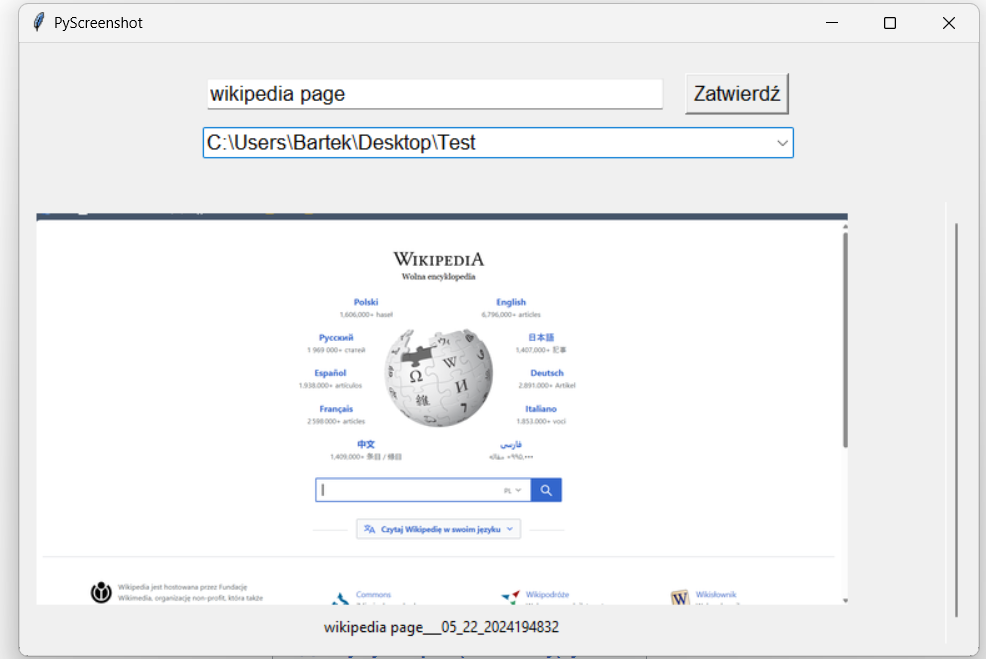

# PyScreenshot v.3

## Overview

PyScreenshot is a Python application built using Tkinter and PIL (Pillow) that allows users to capture, save, and manage screenshots. The application provides a user-friendly interface for saving screenshots from the clipboard to a specified directory and viewing them in a scrollable list.

## Features

- Capture screenshots directly from the clipboard.
- Save screenshots to a specified path and a default folder.
- Maintain a list of recently used directories.
- Editable image labels for better organization.
- Scrollable image list for easy navigation and viewing.
- Image viewer for opening images in a new window.

## Requirements

- Python 3.x
- Pillow
- Tkinter

## Installation

1. Clone the repository:
    
    `git clone https://github.com/yourusername/PyScreenshot.git cd PyScreenshot`
    
2. Install the required Python packages:
    
    `pip install Pillow`
    

## Usage

1. Set in `.config` file your default screenshots folder
2. Run the application:

    `python main.py`
    
3. Choose a directory to save or type a new one.
4. Type the screenshot name.
5. Save it using the "Zatwierdź" button.
   
7. The saved screenshots will appear in a scrollable list.
   You can change their names by clicking on corresponding textbox under screenshot and zoom them in by clicking on screenshot miniature.

## File naming 
If you won't specify the screenshot name will be saved with name:
`MM_DD_YYYhhmmss.jpg` in chosed folder and `shortened__path___MM_DD_YYYhhmmss.jpg` in default folder.

If you won't specify the directory to save, screenshot will be saved only in default folder with name `name___MM_DD_YYYhhmmss.jpg`

Normally screenshot will be saved in default folder with name:
`shortened__path___name___MM_DD_YYYhhmmss.jpg`
and in selected folder with name:
`name___MM_DD_YYYhhmmss.jpg`
## File Structure

- `main.py`: The main script containing the application logic.
- `.config`: A JSON configuration file storing the default folder path and recent directories.

## Configuration File

The `.config` file is a JSON file that stores the default folder path and recent directories.

- **Example:**
    
    `{     "default_folder": "C:/Screenshots",     "latest_directories": ["C:/Projects", "C:/Images"] }`
    

## License

This project is licensed under the MIT License.
